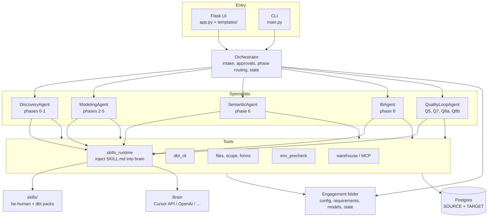
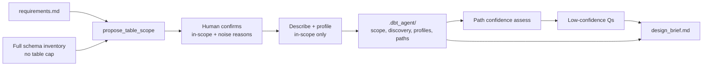
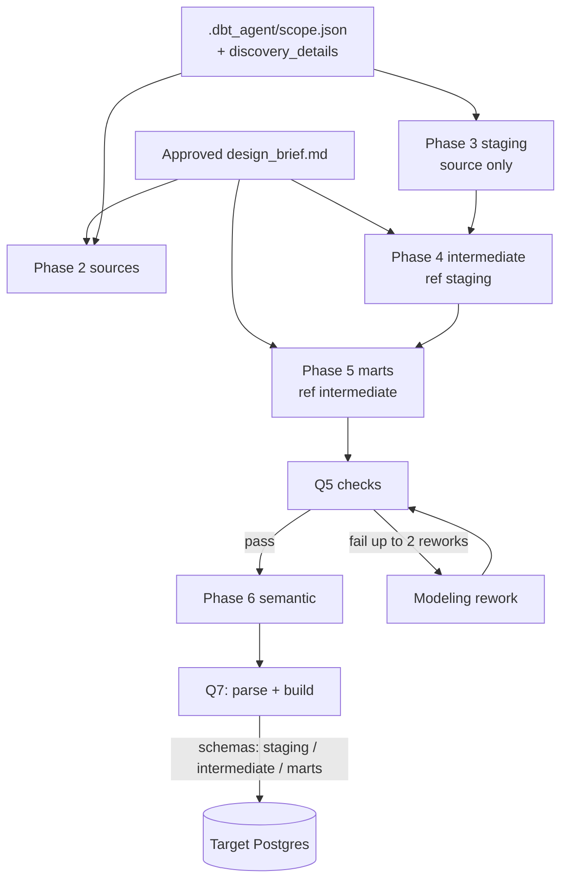
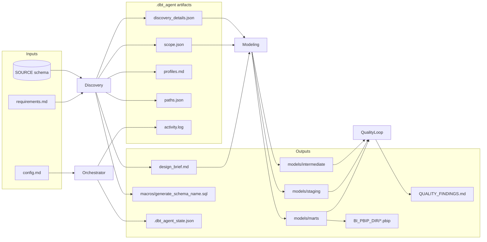

# dbt-agent

Chat-driven multi-agent system that turns business requirements and a landed warehouse into a dbt project (staging → intermediate → marts), quality gates, and optional Power BI wiring.

Engagements are **separate folders** (for example under `C:\wamp64\www\dbt-agent-run\`). This repo is the agent runtime; it does not store client credentials or warehouse data.

---

## How the agent works

### 1. System architecture

Who talks to whom when you use the UI or CLI.



### 2. End-to-end engagement flow

Full path from Open through delivery, including every human gate.

```mermaid
flowchart TD
  A[Open engagement folder] --> B[Env precheck]
  B --> C[Brain form + link check]
  C --> D[Path confidence threshold]
  D --> E[Warehouse type + connection form]
  E --> F{Warehouse probe OK?}
  F -->|no| E
  F -->|yes| G[Paste requirements.md]
  G --> H[Phase 0: bootstrap dbt + schema macro]
  H --> I[Phase 1: list all tables]
  I --> J[Propose in-scope + noise reasons]
  J --> K{Human: TABLE_SCOPE}
  K -->|yes or revised list| L[Describe + profile in-scope only]
  L --> M[Assess KPI paths + confidence percent]
  M --> N{Any path under threshold?}
  N -->|yes| O["PATH_CLARIFY\none question at a time"]
  O --> N
  N -->|no / all answered| P[Write design_brief.md]
  P --> Q{Human: approve brief?}
  Q -->|no| P
  Q -->|yes| R[Phase 2: _sources.yml]
  R --> S[Phase 3: staging models]
  S --> T[Phase 4: intermediate]
  T --> U[Phase 5: marts]
  U --> V[Q5: structure + domain QA]
  V -->|needs_rework| U
  V -->|pass| W[Phase 6: semantic optional]
  W --> X[Phase 7: dbt parse + dbt build]
  X --> Y[Q7]
  Y -->|pass| Z["Human: save .pbip under BI_PBIP_DIR\nimport marts, refresh, yes"]
  Z --> AA[Phase 8: PBI relationships]
  AA --> AB[Q8a]
  AB --> AC[Human: Wireframe approved]
  AC --> AD[Phase 8 visuals]
  AD --> AE[Q8b]
  AE --> AF[Human: Phase 8 OK]
  AF --> AG[Delivery complete]
```



### 3. Phase 1 discovery detail



### 4. Modeling and quality loop



### 5. Data / artifact graph



### Component responsibilities

| Piece | Role |
|-------|------|
| **Orchestrator** | Chat intake, yes/no gates, which phase runs next, persist `.dbt_agent_state.json` |
| **DiscoveryAgent** | Bootstrap (0), scope, path clarify, design brief (1); writes schema macro |
| **ModelingAgent** | Sources → staging → intermediate → marts (2–5) from brief + scope artifacts |
| **SemanticAgent** | Metric / semantic YAML (6) when enabled |
| **BiAgent** | Power BI relationships and visuals (8) |
| **QualityLoopAgent** | Q5 / Q7 / Q8a / Q8b; writes `QUALITY_FINDINGS.md`; may trigger rework |
| **Tools** | Warehouse/MCP, dbt CLI, file IO, forms, scope, env precheck, skills injection |
| **Brain** | LLM (Cursor API / OpenAI / …) for briefs, path questions, and domain-aware SQL |
| **Skills** | Cursor-style `SKILL.md` packs injected into every brain system prompt |

---

## What it does

1. Collects brain (LLM) and warehouse connection settings.
2. Discovers schema, proposes table scope (with noise reasons), and clarifies low-confidence data paths one question at a time.
3. Drafts a design brief from discovery artifacts.
4. After you approve the brief, generates `_sources.yml`, staging, intermediate, and mart models.
5. Runs quality checks, then `dbt parse` + `dbt build` into plain Postgres schemas: `staging` / `intermediate` / `marts`.
6. Continues into semantic layer and Power BI (`.pbip` under `BI_PBIP_DIR`) when configured.

The agent is **domain-agnostic**: scope, KPIs, and model names come from `requirements.md`, discovery, and the design brief — not hardcoded project names.

Brain calls use **Cursor API / OpenAI as a chat backend**. Cursor IDE skills are not attached automatically; the app injects matching packs from `skills/` into the system prompt (same idea as IDE skills).

---

## Requirements

| Piece | Notes |
|-------|--------|
| Python 3.11+ | Local `.venv` |
| Node.js | Cursor LLM bridge (`@cursor/sdk`) |
| dbt-core + dbt-postgres | Via `requirements.txt`; Open / `check env` can install missing pieces |
| Postgres | v1 warehouse (source + target) |
| Optional MCP | Postgres / Power BI modeling MCP via agent `.env` |

---

## Quick start

```bash
cd C:\wamp64\www\dbt-agent
python -m venv .venv
.venv\Scripts\activate
pip install -r requirements.txt
copy .env.example .env
npm install
```

Edit `.env` (brain provider, Flask secret, optional MCP / skills paths). Then:

```bash
python app.py
```

Open [http://127.0.0.1:5050](http://127.0.0.1:5050).

1. Paste an engagement folder path (must sit under `ENGAGEMENTS_ROOT`, default = parent of this repo).
2. Click **Open**.
3. Answer brain / confidence / warehouse forms in chat.
4. Paste business requirements when asked.
5. Confirm table scope and low-confidence path questions.
6. Review and approve `design_brief.md`, then continue through modeling and validation.
7. After Q7: save a **`.pbip`** under `BI_PBIP_DIR`, import marts, refresh, reply yes.

### CLI

```bash
python main.py --project C:\path\to\engagement
python main.py --project C:\path\to\engagement status
```

Useful phrases: `help`, `status`, `continue`, `check env`, `check links`, `yes` / `no` when prompted.

---

## Configuration (`.env`)

Copy from `.env.example`. Important keys:

| Variable | Purpose |
|----------|---------|
| `LLM_PROVIDER` | `cursor` (default), `openai`, or Ollama / vLLM patterns in the example |
| `MODEL` | Model id for the chosen provider |
| `CURSOR_API_KEY` / `API_KEY` | Provider credentials |
| `FLASK_HOST` / `FLASK_PORT` | Web UI bind (keep `127.0.0.1` for local-only) |
| `FLASK_SECRET_KEY` | Session stability across restarts |
| `ENGAGEMENTS_ROOT` | Allowlist root for engagement paths |
| `DBT_EXECUTABLE` | Optional override; otherwise prefers `.venv` dbt |
| `DBT_SKILLS_ROOT` | Optional parent of skill packs (each subfolder has `SKILL.md`) |
| `MCP_POSTGRES_*` / `MCP_POWERBI_*` | MCP command + args (agent `.env` only — never from engagement `config.md`) |

Engagement-specific DB host/user/password live in that engagement’s `config.md`, not in the agent `.env`.

---

## Engagement folder

| Path | Role |
|------|------|
| `config.md` | Project name, SOURCE/TARGET warehouse, `STAGING_SCHEMA` / `INTERMEDIATE_SCHEMA` / `MARTS_SCHEMA`, `BI_PBIP_DIR` |
| `requirements.md` | Business goals and questions (no SQL required from you) |
| `design_brief.md` | Agent-drafted brief; approve via UI **yes** or Status: approved |
| `dbt_project.yml`, `profiles.yml`, `models/` | Generated by the agent |
| `macros/generate_schema_name.sql` | Plain layer schemas (no `staging_marts` prefix) |
| `.dbt_agent/` | Discovery artifacts + **`activity.log`** (append-only audit; UI Activity History stays session-only) |
| `.dbt_agent_state.json` | Pipeline state (phase, intake, quality) |
| `QUALITY_FINDINGS.md` | QA checkpoint output |
| `BI_PBIP_DIR/` (default `powerbi-project/`) | Human saves **Power BI Project (`.pbip`)** here before Phase 8 |

Templates for a new engagement are under `kit/`.

### Target warehouse schemas

| Schema | Contents |
|--------|----------|
| `staging` | `stg_*` views |
| `intermediate` | `int_*` views |
| `marts` | `fct_` / `dim_` / `bridge_*` tables |

Profile default schema is `dbt` (fallback only). Layer names come from `dbt_project.yml` + `generate_schema_name`.

---

## Delivery phases (0–8)

| Phase | What happens |
|-------|----------------|
| **0** | Bootstrap `dbt_project.yml`, packages, profiles, folders, `macros/generate_schema_name.sql`; `dbt deps` |
| **1** | Discover schema → propose scope → path confidence Q&A → write design brief |
| **2** | Write `_sources.yml` for confirmed in-scope tables |
| **3** | Staging models (`source()` only, no joins) |
| **4** | Intermediate models (`ref` staging) |
| **5** | Marts from brief + Q5 structural/domain QA |
| **6** | Semantic models / docs (when enabled) |
| **7** | `dbt parse` + `dbt build` |
| **8** | Power BI relationships / visuals (after Desktop `.pbip` import + human gates) |

### Power BI Desktop import gate

After Q7 passes, the UI asks you to:

1. Create `BI_PBIP_DIR` under the engagement (default `powerbi-project/`).
2. In Power BI Desktop, save as **Power BI Project (`.pbip`)**, not `.pbix`, **inside that folder**.
3. Import tables from the target **`marts`** schema; refresh; save.
4. Reply **yes** (or `Desktop import OK`).

---

## Quality gates

- **Q5** — Brief sections; staging / intermediate / marts present; expected names from the brief; no placeholders; layering rules; domain-family coverage from scoped tables.
- **Q7** — Always `dbt parse` and `dbt build` (ensures plain schemas exist in Postgres).
- **Q8a / Q8b** — Power BI relationship and visual checks when BI is in use.

Failures land in `QUALITY_FINDINGS.md` with a rework target.

---

## Skills (brain prompts)

Cursor IDE attaches skills automatically; this app injects them in `llm_fill` via `tools/skills_runtime.py` before each Cursor API / OpenAI call.

| Path | Role |
|------|------|
| `skills/be-human/` | Always on — plain human prose |
| `skills/dbt/using-dbt-for-analytics-engineering` | Discovery / modeling / quality |
| `skills/dbt/running-dbt-commands` | Modeling / build / CLI |
| `skills/dbt/adding-dbt-unit-test` | Quality / tests |
| `skills/dbt/building-dbt-semantic-layer` | Semantic agent |
| `skills/dbt/fetching-dbt-docs` | Discovery |
| `skills/dbt/troubleshooting-dbt-job-errors` | Build failures |
| `skills/dbt/working-with-dbt-mesh` | When mesh/contracts appear |
| `skills/dbt/creating-mermaid-dbt-dag` | Lineage requests |

Search order: `skills/` → `skills/dbt/` → `DBT_SKILLS_ROOT` → `~/.cursor/skills` → `~/.agents/skills`.

Phase prompt packs live separately under `prompts/` (`system.md`, `phase_*.md`, `quality_*.md`).

---

## Activity History vs trail

| Surface | Behavior |
|---------|----------|
| **UI Activity History** | In-memory only for the Flask session; cleared on **Open** |
| **`.dbt_agent/activity.log`** | Append-only audit file; not reloaded into the UI |

---

## Repository layout

```
dbt-agent/
|-- app.py                 # Flask UI
|-- main.py                # CLI
|-- orchestrator.py        # Phase routing, intake, approvals
|-- pipeline_state.py      # Persisted engagement state
|-- activity_log.py        # Live UI feed + trail append
|-- security_util.py       # Path allowlist / safe IO
|-- logging_util.py
|-- agents/                # discovery, modeling, semantic, bi, quality_loop
|-- tools/                 # warehouse, dbt_cli, dbt_schemas, skills_runtime, …
|-- llm/                   # Cursor / OpenAI-compatible clients
|-- prompts/               # Phase + quality prompt packs
|-- skills/be-human/       # Always-on writing skill
|-- skills/dbt/            # Vendored dbt skill packs
|-- kit/                   # Engagement file templates
|-- templates/             # Web UI
|-- scripts/               # cursor_chat.mjs bridge
|-- design-system/         # UI tokens / console page rules
|-- requirements.txt
|-- package.json           # @cursor/sdk for Cursor brain
|-- .env.example
|-- README.md              # This file (only project README)
```

---

## Brain providers

Configured in the UI form and written to agent `.env`:

- **Cursor** — default; `CURSOR_API_KEY` + Node bridge.
- **OpenAI** — enabled; `API_KEY` and optional `BASE_URL`.
- **Ollama / vLLM** — patterns in `.env.example` (enable as needed).

---

## Security notes

- Do not commit `.env` or engagement `profiles.yml` / passwords.
- Engagement paths are validated under `ENGAGEMENTS_ROOT`.
- MCP commands come only from agent `.env`, not from engagement config.
- Flask is intended for local use (`127.0.0.1`).

---

## Troubleshooting

| Symptom | What to try |
|---------|-------------|
| Brain form / Open fails | `check links`; confirm keys in `.env`; restart `python app.py` after Python changes |
| `No module named 'dbt'` | Activate `.venv`, `pip install -r requirements.txt`, or `check env` in chat |
| Empty Postgres schemas after build | Confirm Q7 ran `dbt build`; check `profiles.yml` target DB |
| Schemas named `staging_marts` / `staging_staging` | Ensure `macros/generate_schema_name.sql` exists; profile schema should be `dbt`; re-run Phase 7 |
| Sparse staging/marts | Re-approve brief; re-run phases 2–5 |
| Path clarify stuck | Answer one question at a time in chat |
| Power BI gate unclear | Save **`.pbip`** under engagement `BI_PBIP_DIR` (default `powerbi-project/`), import `marts`, refresh, reply yes |
| UI looks stale | Hard-refresh (`Ctrl+F5`); restart Flask after Python module changes |

---

## Development

```bash
.venv\Scripts\activate
pip install -r requirements.txt
npm install
python app.py
```

After changing Python modules, restart Flask. Templates usually pick up on refresh; hard-refresh if CSS/JS looks cached.

---

## License / usage

Internal engagement tool. Keep secrets out of git; treat each engagement folder as the unit of delivery for a client domain.
